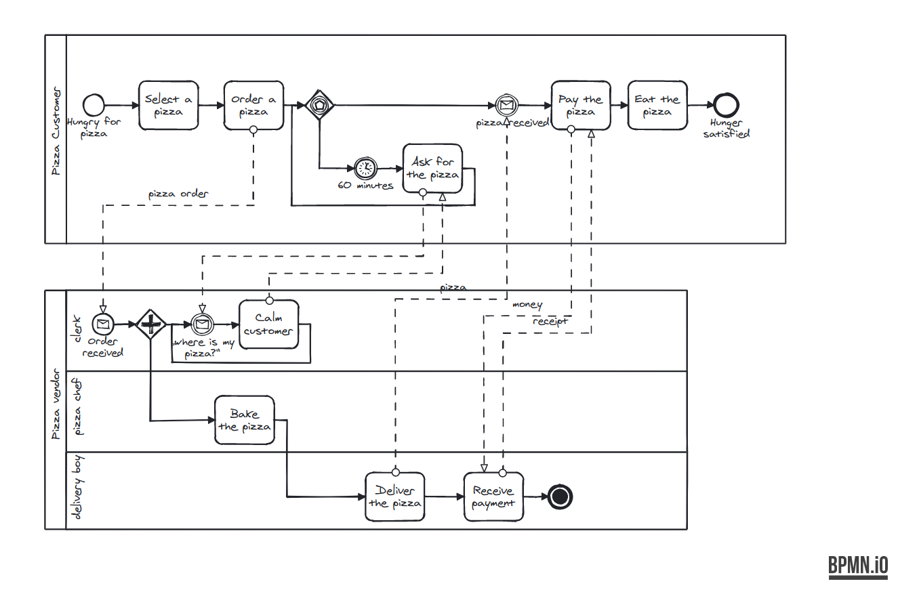

# bpmn-js-sketchy

A sketchy renderer for [bpmn-js](https://github.com/bpmn-io/bpmn-js).



## Usage

Extend bpmn-js with the sketchy renderer module:

```javascript
import modeler from 'bpmn-js/lib/Modeler';

const modeler = new Modeler({
  // ...
  additionalModules: [ sketchyRendererModule ]
});
```

Check out [this test](test/SketchyRendererSpec.js#L42) for more information.


## Licence

MIT